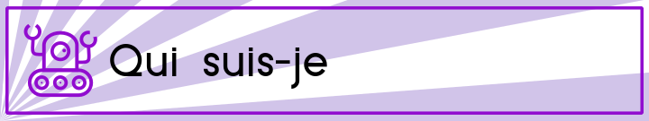
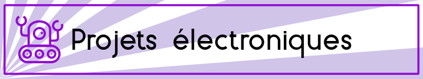

Je m'appelle Anthony Rabine et je suis développeur Freelance depuis 2018, ma société se nomme D8S EURL. Je touche un peu à tout, mais je travaille essentiellement sur du firmware (logiciel embarqué sur des cartes électroniques) et des logiciels, sur PC, Mac ou Android, surtout programmés avec le framework Qt/QML (en C++/Javascript). Quelques fois de la programmation web (Vue.js / Node), quand il faut !

Cette page existe pour parler de mes projets personnels. Mon but ? Offrir des alternatives libres à des solutions propriétaires.

Un logiciel ? Une application Android ? Un système électronique ? Il existe quelques fois des alternatives libres, d'autres fois non. Le problème des solutions propriétaires est leur pérennité et leur maintenance.

Lorsque qu'une entreprise ferme ou abandonne un logiciel ou un produit, impossible de le corriger ou de le réparer.

Le libre, qu'il soit matériel ou logiciel, permet d'étendre la durée de vie des produits que nous utilisons.

Tout ceux qui aiment ce que je produis peuvent me soutenir ici.

Mais également je vous offre l'opportunité de combler votre besoin. Si un logiciel vous manque, n'hésitez pas à m'en faire part ! Cela pourrait se transformer en projet bien réel.

Je développe régulièrement de nouvelles applications (ma TODO list est énorme !) que je partage sous licence Libre le plus souvent, mais pas toujours car je tente d'en vendre certains pour m'assurer un petit complément de revenus. Allez donc jeter un coup d’œil sur ma page Github !

En tâche de fond, je développe les logiciels suivants :

    TarotClub (http://tarotclub.fr), un jeu de Tarot libre, en réseau avec des ambitions et des idées assez larges (IA, modes de jeu, accessibilité ...), avancé à environ 75%
    Manolab : un logiciel d'automatisation industrielle (en cours de développement, 20% environ)
    Moniteo : un logiciel de chronométrage de courses (à pied, vélo, chien ...)

D'autres logiciels passés ou récents qui me permettent de valider des concepts :

    Tanca (http://tanca.fr), un logiciel de gestion de Club et de Concours de Pétanque (ne sera plus mis à jour). Une version Web sera éventuellement proposée
    Galaxie de mots : une application Android servant de démonstrateur : je souhaite ajouter petit à petit de nouveaux jeux selon les demandes

Une boîte à histoires pour les enfants

OpenStoryTeller est un projet de boîte à histoires libre pour enfants, en essayant d'utiliser de vieilles cartes de développement qui traînent dans les tiroirs. Nous visons ici la maintenance de l'appareil et l'utilisation de composants faciles à trouver car comme le savent les parents, si la boîte à histoire tombe en panne c'est la cata !

    Projet contenant les dépôts : https://github.com/OpenStoryTeller
    Page projet Hackaday : https://hackaday.io/project/175210-openstoryteller

Autres projets à venir

D'autres projets sont en cours de réflexion :

        automatisation de porte de garage
        Des briques matérielles pour le logiciel d'automatisation Manolab
        Des solutions matérielles pour le chronométrage de courses qui seront supportées par le logiciel Moniteo

Je tente de **redonner** ce que j'ai acquis. Une des façons est de partager mon code, je le fais avec mon dépôt Github, mais également par des écrits.

Un blog

Mon site institutionnel est https://d8s.fr, j'aime y partager mes connaissances car j'ai beaucoup appris grâce aux autres :

    aux projets Open Sources
    aux collègues
    aux articles techniques de blogs

Vous trouverez donc sur mon site des articles gratuits.

Des livres

Je bosse actuellement sur deux livres libres qui auront peut-être une version papier physique.

    Un livre sur le développement embarqué, assez orienté conseils et bonnes pratiques avec des exemples de code concrets sortis de mes expériences professionnelles
    Un livre sur mon expérience de freelance, avec là aussi quelques conseils pratiques, des anecdotes et le récit de mon parcours

Des formations

Je travaille également sur l'élaboration de projets concrets qui seront accessibles via des formations payantes. Une bonne façon de me supporter !

